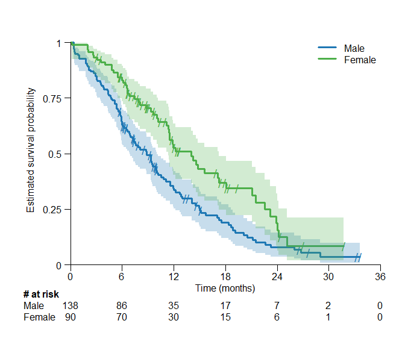

<!-- README.md is generated from README.Rmd. Please edit that file -->

# survSAKK <a href="https://sakk-statistics.github.io/survSAKK"></a>

## Overview

The goal of `survSAKK` is to create an open source, user-friendly and
flexible `R` package, which will incorporate various statistics and
layout customization options to enhance the efficiency and adaptability
of the Kaplan-Meier plot.

## Installation

You can install the current version of `survSAKK` from [GitHub
Pages](file:///C:/Users/vithersans/Desktop/survSAKK/docs/index.html):

``` r
# install.packages("devtools")

# At the moment, while repository is private:
devtools::install_github("SAKK-Statistics/survSAKK",
                         auth_token = "ask_for_the_password",
                         build_vignettes = TRUE,
                         force = TRUE)

# Later, when the repository is public:
devtools::install_github("SAKK-Statistics/survSAKK",
                         build_vignettes = TRUE)
```

## Usage

``` r
library(survSAKK)
library(survival)
#> Warning: Paket 'survival' wurde unter R Version 4.3.2 erstellt

lung_fit <- survfit(Surv((time/365.25), status) ~ sex, data = lung)

surv.plot(fit = lung_fit)
```



## Getting help

The documentation of the function.

### Documentation

- `help(survSAKK)`

- `help(surv.plot)`

### Vigniette

- `vignette("surv.plot", package = "survSAKK")`
